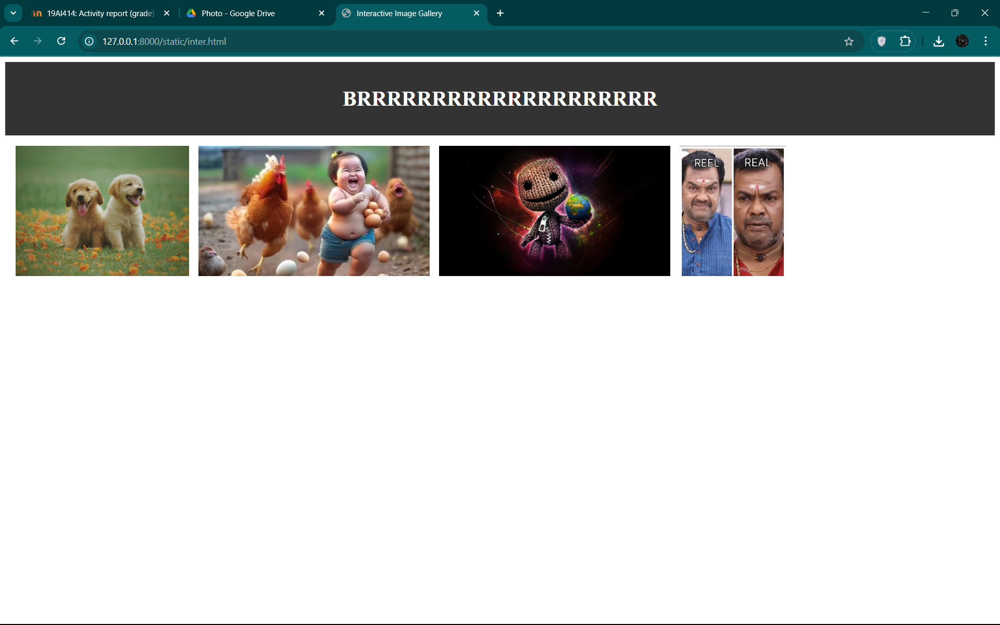

# Ex.08 Design of Interactive Image Gallery
## Date:

## AIM:
To design a web application for an inteactive image gallery with minimum five images.

## DESIGN STEPS:

### Step 1:
Clone the github repository and create Django admin interface.

### Step 2:
Change settings.py file to allow request from all hosts.

### Step 3:
Use CSS for positioning and styling.

### Step 4:
Write JavaScript program for implementing interactivity.

### Step 5:
Validate the HTML and CSS code.

### Step 6:
Publish the website in the given URL.

## PROGRAM :
```
inter.html
<!DOCTYPE html>
<html lang="en">
<head>
    <meta charset="UTF-8">
    <meta name="viewport" content="width=device-width, initial-scale=1.0">
    <title>Interactive Image Gallery</title>
</head>
<body>
    <header style="text-align: center; background-color: #333; color: white; padding: 1rem 0;">
        <h1>OOOPPPPPPPSSSSSSSSSSSSS</h1>
    </header>

    <div style="white-space: nowrap; overflow-x: auto; padding: 1rem;">
        <div style="display: inline-block; margin-right: 10px;" onclick="openModal(this)">
            
        </div>
        <div style="display: inline-block; margin-right: 10px;" onclick="openModal(this)">
            
        </div>
        <div style="display: inline-block; margin-right: 10px;" onclick="openModal(this)">
            
        </div>
        <div style="display: inline-block;" onclick="openModal(this)">
            
        </div>
    </div>
    <div id="modal" style="display: none; position: fixed; z-index: 1; left: 0; top: 0; width: 100%; height: 100%; background-color: rgba(0,0,0,0.9);">
        <span style="position: absolute; top: 15px; right: 35px; color: white; font-size: 40px; font-weight: bold; cursor: pointer;" onclick="closeModal()">&times;</span>
        
    </div>

    <script>
        function openModal(element) {
            var modal = document.getElementById("modal");
            var modalImg = document.getElementById("modalImage");
            modal.style.display = "block";
            modalImg.src = element.querySelector("img").src;
        }

        function closeModal() {
            document.getElementById("modal").style.display = "none";
        }
    </script>
</body>
</html>

style.js
function openModal(element) {
    const modal = document.getElementById("modal");
    const modalImage = document.getElementById("modalImage");
    const caption = document.getElementById("caption");

    modal.style.display = "flex";
    modalImage.src = element.querySelector("img").src;
    caption.textContent = element.querySelector("img").alt;
}

function closeModal() {
    const modal = document.getElementById("modal");
    modal.style.display = "none";
}

style.css
body {
    margin: 0;
    font-family: Arial, sans-serif;
  }
  
  header {
    background-color: #4CAF50;
    color: white;
    text-align: center;
    padding: 1rem;
  }
  
  /* Put images in a row */
  .gallery {
    display: flex;
    justify-content: center;
    gap: 20px;
    padding: 20px;
  }
  
  /* Style each image */
  .gallery-item img {
    width: 200px;
    border: 3px solid transparent;
    cursor: pointer;
    transition: transform 0.3s, border-color 0.3s;
  }
  
  /* Highlight the clicked image */
  .gallery-item img.active {
    border-color: #4CAF50;
    transform: scale(1.05);
    box-shadow: 0 0 10px green;
  }
  
  /* Modal styles */
  .modal {
    display: none;
    position: fixed;
    z-index: 1000;
    top: 0; left: 0;
    width: 100%; height: 100%;
    background: rgba(0, 0, 0, 0.8);
  }
  
  .modal-content {
    display: block;
    margin: 80px auto;
    width: 80%;
    max-width: 700px;
  }
  
  .close {
    position: absolute;
    top: 15px;
    right: 30px;
    color: white;
    font-size: 40px;
    cursor: pointer;
}
```

## OUTPUT:



## RESULT:
The program for designing an interactive image gallery using HTML, CSS and JavaScript is executed successfully.